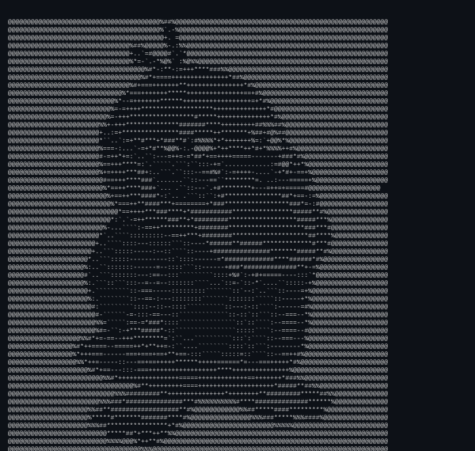

<div align="center">

# 👋 Hi, I'm Prathamesh More

<p>
Building AI-powered applications, Full Stack Web Apps, and Cybersecurity Projects.
</p>


<br><br>

<h3><code>prathamesh@github ~ $ ./contributions.sh</code></h3>



<br><br>

<h3><code>prathamesh@github ~ $ whoami</code></h3>

<table>
<tr>
<td valign="top">

</td>

<td valign="top">

</td>
</tr>
</table>

<br>

<h3><code>prathamesh@github ~ $ tech-stack</code></h3>

<p>


</p>

<br>

<h3><code>prathamesh@github ~ $ links</code></h3>

<p>

<a href="https://github.com/prathameshmore07">

</a>

<a href="https://www.linkedin.com/in/prathamesh-more-in/">

</a>

<a href="https://x.com/morepprathamesh6">

</a>

</p>

<br>

<h3><code>prathamesh@github ~ $ currently_building</code></h3>

```text
• AI Agents
• Cybersecurity Tools
• Full Stack SaaS Applications
• Open Source Projects
```

</div>